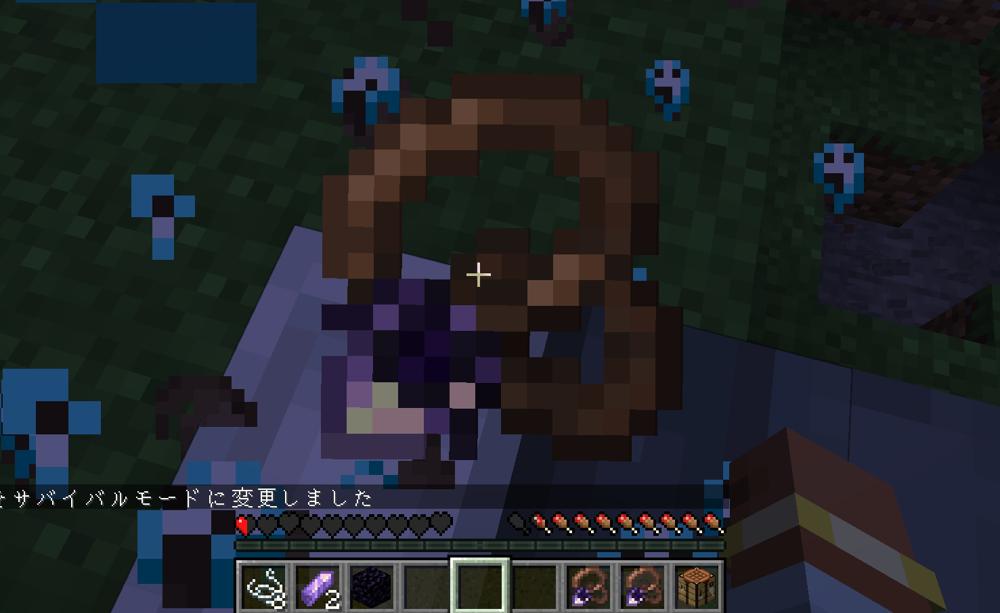
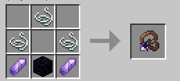

# AmuletOfReturning
**This README.md has been translated using an LLM.**

A NeoForge mod for Minecraft 1.21.1 that adds magical amulets with unique protective abilities.

This mod is designed for players who want to keep things as simple as possible; it is a standalone release of the **‘Amulet of Returning’** item, taken from my other mod, **‘Phoska’**.
## Amulet of Returning

A death-protection necklace worn in the Curios necklace slot. When you take fatal damage, the amulet activates — canceling your death, restoring 1 HP, and teleporting you to safety.

### How It Works

1. **Craft** the Amulet of Returning
2. **Equip** it in a Curios necklace slot
3. **Die** (or try to) — the amulet consumes itself, saves you at 1 HP, and teleports you to your respawn point

On activation, you'll see a custom overlay animation (similar to the Totem of Undying) and particle effects at your arrival location.



### Teleport Priority

| Priority | Destination | Condition |
|----------|-------------|-----------|
| 1 | Bound Waystone | Waystones mod installed + amulet linked to a Waystone |
| 2 | Bed / Respawn Anchor | Player has a respawn point set |
| 3 | World Spawn | Fallback |

### Crafting Recipe



## Waystones Integration (Optional)

If [Waystones](https://www.curseforge.com/minecraft/mc-mods/waystones) by BlayTheNinth is installed, you can bind the amulet to a specific Waystone:

- **Hold** the Amulet of Returning in your hand
- **Sneak + Right-click** a Waystone to register it
- **Sneak + Right-click** the same Waystone again to unregister
- When the amulet activates on death, you'll teleport next to the bound Waystone instead of your bed
If the bound Waystone is destroyed, the amulet falls back to normal respawn behavior.

The amulet's tooltip shows the bound Waystone coordinates when Waystones is installed.

## Dependencies

| Mod | Required? |
|-----|-----------|
| Curios API | Required |
| Waystones | Optional |
| Balm | Optional (required if using Waystones) |

## Building from Source

```bash
git clone https://github.com/MANAna7/AmuletOfReturning.git
cd AmuletOfReturning
./gradlew build
```

The built jar will be in `build/libs/`.

## License

This project is licensed under the MIT License — see the [LICENSE](LICENSE) file for details.